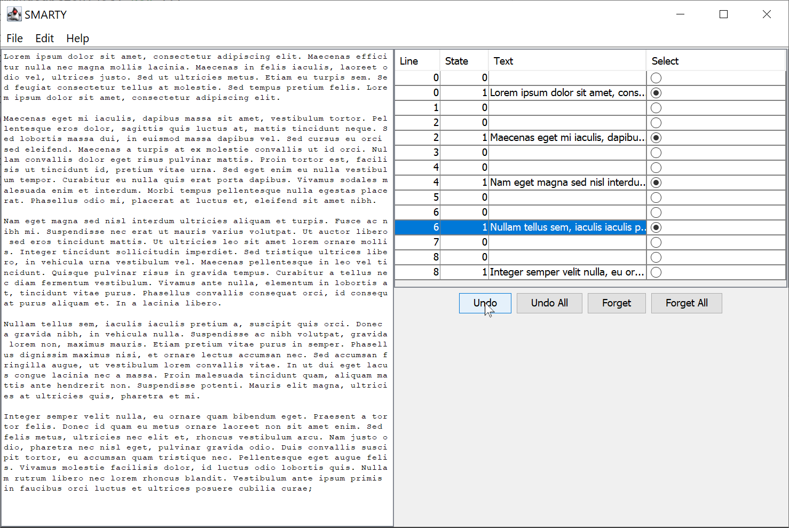

--------------
SMARTY PROJECT - As a part of COMP 5541 Files and Databases course in Concordia University
--------------

Smarty is a text editor with undo, forget, undo all, forget all. This program is created to learn Java GUI programming and data structure management.

The below is a sample page with Lorem Ipsum.

# HOW TO SETUP A LOCAL BRANCH, COMMIT CHANGES, SETUP A REMOTE BRANCH, AND MAKE A PULL REQUEST

# set a local clone of master in shared repo
mkdir REPOS
cd REPOS

git clone -b master https://github.com/astrion/Smarty_Java-PHP-SQL-based-User-Subscription-Management-System.git
cd Smarty_Java-PHP-SQL-based-User-Subscription-Management-System

# get the latest branch info and check branches
git fetch
git branch
git branch -a
git status

# create a new branch
git branch my_branch
git checkout my_branch

# (optional) the line below as a sum of the two commands above
git checkout -b my_branch

# set local branch to pull upstream from local master
git pull
git branch --set-upstream-to=master my_branch

# work on your branch, and then check diff and status
git diff
git status

# commit your changes
git add src/file1
git add src/file2
git commit -m "#: update of file1 and file2 for adding X feature"
git status

# (once only) push to a remote copy of the local branch you are working with
git push -u origin my_branch

# (if a remote branch already exists)
git push origin my_branch

# HOW TO RUN UNIT TESTS
1. Open IntelliJ
2. Right-click on Smarty_Java-PHP-SQL-based-User-Subscription-Management-System/src/test
3. Left-click on'Run 'Tests in 'test''